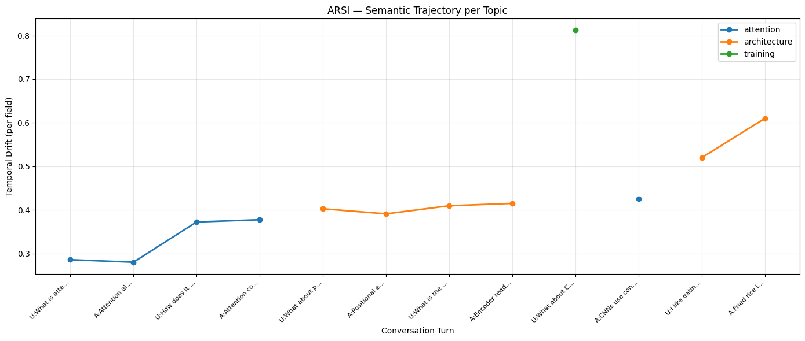
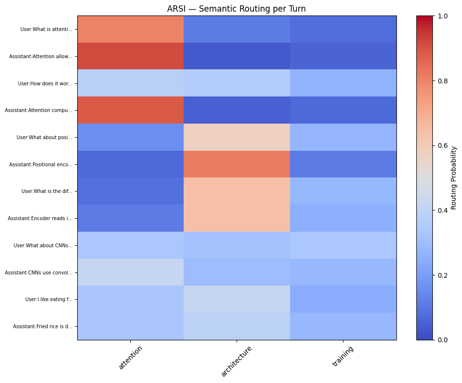

# ARSI — Semantic Drift Monitoring for AI Systems

[](https://colab.research.google.com/github/agusbass/ARSI/blob/main/ARSI.ipynb)
[](https://opensource.org/licenses/MIT)

ARSI is an experimental lightweight framework for monitoring semantic drift in AI systems.

It focuses on:
- topic drift detection,
- conversational trajectory tracking,
- probabilistic semantic routing,
- and temporal semantic consistency.

ARSI is designed for experimentation with:
- LLM agents,
- chatbot conversations,
- RAG pipelines,
- and semantic observability workflows.

---

# ✨ Key Features

## Adaptive Semantic Fields

Each semantic field maintains:
- its own centroid,
- semantic spread,
- and temporal drift memory.

This allows ARSI to distinguish between:
- narrow semantic domains,
- broad semantic domains,
- and gradual conversational drift.

---

## Probabilistic Routing

ARSI routes inputs using:
- cosine similarity,
- temperature-scaled softmax,
- and adaptive semantic calibration.

Instead of assigning a single hard label, ARSI produces:
- routing probabilities,
- uncertainty estimates,
- and semantic stability signals.

---

## Temporal Drift Monitoring

ARSI tracks semantic drift over time using:
- per-field exponential moving averages (EMA),
- conversational trajectory monitoring,
- and temporal semantic continuity signals.

This enables lightweight monitoring of:
- topic transitions,
- semantic instability,
- and gradual drift accumulation.

---

## Human-in-the-Loop Updates

Semantic fields can be updated dynamically from user feedback.

This allows experimentation with:
- adaptive semantic memory,
- topic refinement,
- and interactive semantic routing.

---

# 📈 Visualization

ARSI provides lightweight semantic observability through:
- temporal drift tracking,
- probabilistic semantic routing,
- and conversational trajectory monitoring.

---

## Semantic Drift Trajectory

The trajectory plot tracks temporal semantic drift per topic field across a multi-turn conversation.



---

## Semantic Routing Heatmap

The heatmap below shows how ARSI distributes routing probabilities across multiple semantic fields over conversational turns.



---
---

# 🚀 Quick Start

## Open in Google Colab

[](https://colab.research.google.com/github/agusbass/ARSI/blob/main/ARSI.ipynb)

---

## Run Locally

```bash
git clone https://github.com/agusbass/ARSI.git
cd ARSI

pip install sentence-transformers scipy matplotlib pandas

jupyter notebook ARSI.ipynb
```

---

# 📊 What ARSI Measures

ARSI estimates several lightweight semantic monitoring signals:

| Signal | Description |
|---|---|
| Drift | Distance from the most relevant semantic field |
| Temporal Drift | Smoothed drift over time |
| Routing Probability | Relative probability across semantic fields |
| Semantic Stability | Heuristic estimate of routing confidence |
| Entropy | Uncertainty across competing semantic fields |

---

# ❓ Why Not Just Cosine Similarity?

Raw cosine similarity measures distance to a fixed semantic anchor.

ARSI extends this idea with:
- adaptive semantic fields,
- probabilistic routing,
- temporal drift memory,
- and uncertainty estimation.

This enables lightweight tracking of:
- conversational transitions,
- gradual topic drift,
- and ambiguous semantic states.

---

# 🔬 Example Use Cases

## Chatbot Drift Monitoring

Detect when a conversation gradually moves away from the intended topic.

---

## Multi-Agent Coordination

Track whether different agents remain within their assigned semantic domains.

---

## RAG Pipeline Observability

Monitor whether retrieved context shifts the semantic direction of generated outputs.

---

## Semantic Consistency Experiments

Explore how conversational trajectories evolve over multiple turns.

---

# ⚠️ Limitations

ARSI is an experimental observability prototype.

It does NOT:
- perform logical reasoning,
- verify factual correctness,
- replace classifiers,
- guarantee hallucination detection,
- or provide production-grade reliability.

ARSI operates purely on:
- embedding similarity,
- temporal drift,
- and heuristic routing signals.

It is intended for:
- monitoring,
- experimentation,
- debugging,
- and semantic observability research.

---

# 📚 Related Areas

ARSI is related to ongoing work in:
- semantic drift monitoring,
- embedding observability,
- conversational trajectory analysis,
- AI monitoring systems,
- and semantic routing experiments.

ARSI focuses specifically on:
- lightweight deployment,
- temporal semantic drift tracking,
- and probabilistic conversational routing.

---

# 🧪 Experimental Status

| Status | Value |
|---|---|
| Version | v1.0 Experimental |
| Environment | Google Colab / Jupyter |
| Benchmarking | Limited notebook evaluation |
| Scalability | Experimental |
| Production Readiness | Not production-ready |

---

# 🛣️ Possible Future Directions

Potential future work may include:
- benchmark evaluation,
- API packaging,
- streaming inference,
- FastAPI integration,
- and larger-scale conversational testing.

---

# 🤝 Contributing

Issues, suggestions, and pull requests are welcome.

Please open an issue before proposing major architectural changes.

---

# 📄 License

MIT License

Free for research and experimentation.

---

# 🔗 Repository

https://github.com/agusbass/ARSI

# 📓 Interactive Notebook

https://colab.research.google.com/github/agusbass/ARSI/blob/main/ARSI.ipynb
